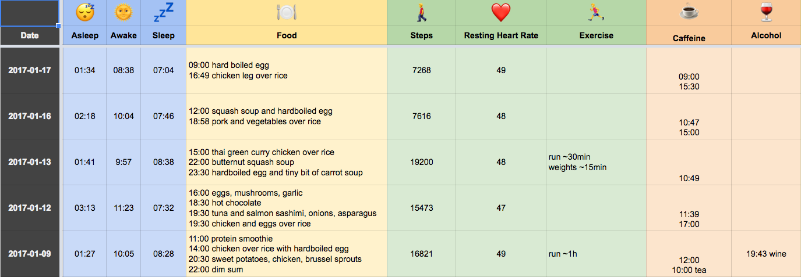

# Use Google Sheets to log your life by texting it Emojis and pulling in data from Fitbit automatically.

The driving philosophy behind this is finding the path of least resistance to life logging. Pull as much data as possible from other passive tracking sources, like Fitbit, automatically. Make it easy as fuck to update the spreadsheet... single-character text messages `☕️`. No apps to install. Use Google Sheets because they are easy and you probably already have a Google account.

## Install

Make sure you have Node 7 or later installed (it needs to support ES6). Sorry... this is kind of a pain to set up. OAuth 2 isn't much fun.

`yarn install` or `npm install`
`yarn global install` or `npm install -g` to install the command line tool

## Google Sheets
1. Create a Google Sheets spreadsheet. Create a header row with column names. Make sure one of them is called "Date".
2. Grab the spreadsheet ID and worksheet ID. Google how to find those on your own.
3. Go to https://console.google.com and create an app. Follow instructions [here](https://github.com/jpillora/node-edit-google-spreadsheet) to get your auth credentials.

## Setup

1. Copy `sample.env` to `.env`.
2. Copy `emoji-map.sample.json` to `emoji-map.json`. Edit it so that the column names match the columns in your spreadsheet. Add all the columns you want. Removing columns might break things because it expects certain columns to exist for the Fitbit stuff. Sorry about that.
3. Set up an account on Twilio. Register a phone number with them. Set it up to receive texts. Get your auth credentials and put it in the `.env` file.
4. Run `middleman.js` on a public IP address. I recommend using [Gomix.com](https://gomix.com/) for this - just copy and paste the code on there and update the callback URL. This will receive SMS messages from Twilio and then proxy them to `server.js` via a socket.io connection as JSON objects. Once you've done that, update `MIDDLEMAN_URL` in your `.env` file with the location of your `middleman.js` server.
5. Set up an application on https://dev.fitbit.com with the Authorization flow. Go to `http://<where ever your middleman.js script is hosted>/fitbit/auth`. Grab the code that it returns and put it in your `.env` file as `FITBIT_AUTH_CODE`. Also update `FITBIT_CLIENT_ID` and `FITBIT_CLIENT_SECRET` which you can get from Fitbit.
6. Run `server.js` anywhere you want. This will open a connection (via socket.io) to the `middleman.js` server and listen for SMS events. The `middleman.js` script will proxy SMS events from Twilio to the server. This allows you to run the server and develop behind a firewall or on a private network.

## Sending Text Messages

Try sending a text message to the phone number you registered with Twilio... perhaps try `☕️`. This should update your spreadsheet.

## Command Line Use

Since you installed this package globally (`-g` or `global`), you can use the command `lifebot` to pull in the latest Fitbit data for today. You can specify a different day by adding a date, `lifebot 2017-01-22`. Or you can specify a range of dates `lifebot 2017-01-01 2017-01-22`. The dates don't have to be in order.

This allows you to update days retroactively. You shouldn't actually need to use this because the server will do this every day automatically at the time specified in your `.env` file.
